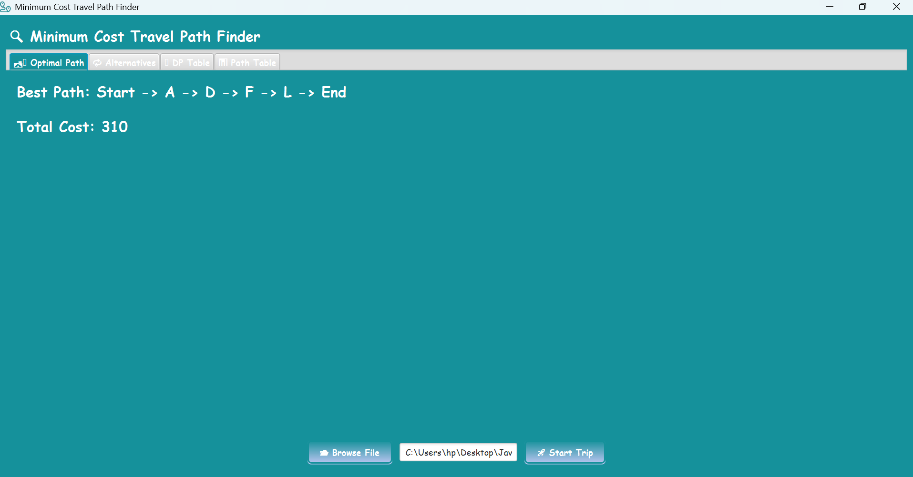
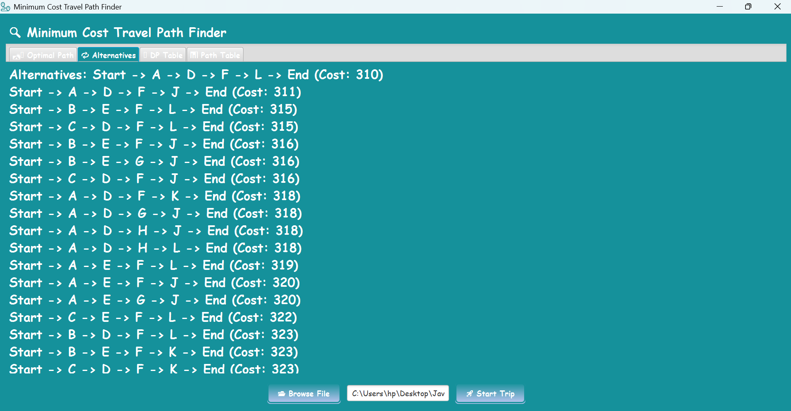
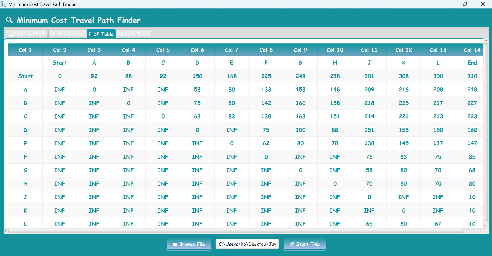
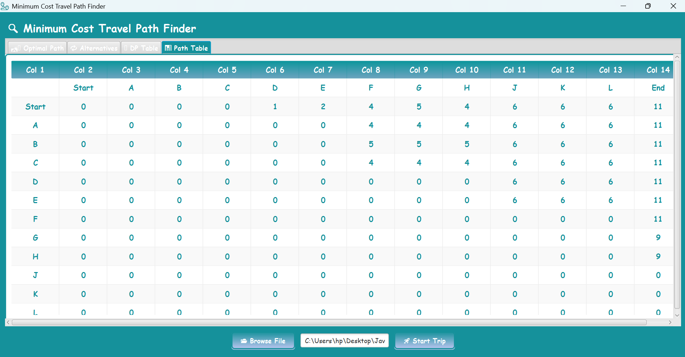

# 🛣️ Minimum Cost Travel Path Finder

Java • JavaFX

---

# 📖 Overview

Minimum Cost Travel Path Finder is a JavaFX desktop application that finds the minimum-cost travel path between a starting city and a destination city.

The application reads city and route information from a text file, calculates the best travel path, displays the total travel cost, lists alternative paths, and shows the generated DP and Path tables through an interactive graphical interface.

---

# ✨ Features

- Load travel data from a text file.
- Find the best path between the start and destination cities.
- Display the total travel cost.
- Show alternative paths sorted by cost.
- Display the Dynamic Programming (DP) table.
- Display the Path table.
- Simple and user-friendly JavaFX interface.
- Browse and load input files using a file chooser.
- Display error messages when invalid input is provided.

---

# 🛠 Technologies Used

- Java
- JavaFX
- Eclipse IDE

---

# 🚀 How to Run

1. Clone the repository

```bash
git clone https://github.com/naghamalomar/Minimum-Cost-Travel-Path-Finder.git
```

2. Open the project in Eclipse.

3. Make sure JavaFX is configured.

4. Run the project.

5. Click **Browse File** and choose the input file (`data.txt`).

6. Click **Start Trip** to display:

- Best Path
- Total Cost
- Alternative Paths
- DP Table
- Path Table

---

# 📸 Screenshots

## Main Window



## Best Path


## Alternative Paths



## DP Table



## Path Table



---

# 📂 Project Structure

```
Minimum-Cost-Travel-Path-Finder-main
│
├── src/
├── data.txt
├── Styles.css
└── README.md
```

---

# 👥 Team Members

- Nagham Alomar

---

# 📜 License

This project was developed for educational purposes.
